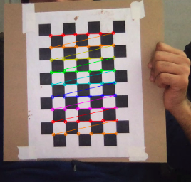

# CameraCalibration
Camera calibration with open cv python

# Usage
1. Collect a sequence of images with the calibration grid
2. move all images of the grid in a folder <PATH>
3. python main.py --images_path <PATH>

## Collect images
- python collect_images.py --seq_name <label-for-this-camera>

# Results

# References
 - https://docs.opencv.org/3.4/dc/dbb/tutorial_py_calibration.html
